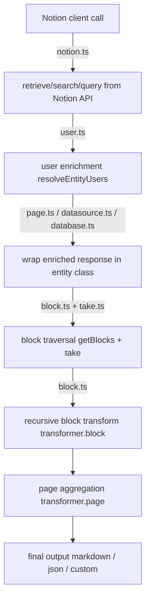
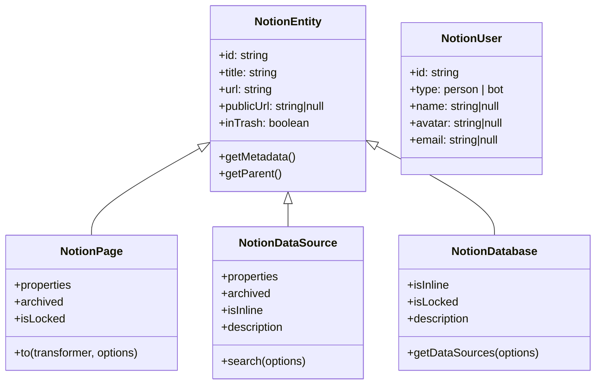
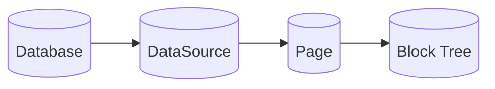
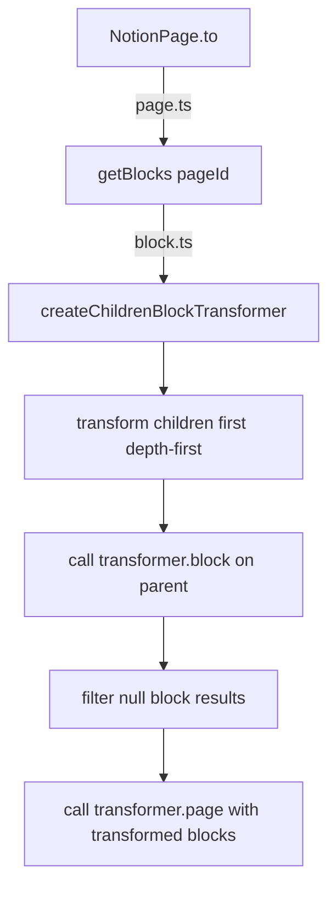

# 🏗️ Architecture

**notion-to-anything** has one goal: turn Notion content into predictable, typed outputs.

The codebase is split into 3 layers:

1. API layer: fetch and wrap Notion entities (`Notion`, `NotionPage`, `NotionDataSource`, `NotionDatabase`)
2. Traversal layer: collect paginated content and recursive blocks (`take`, `getBlocks`, concurrency helpers)
3. Transformation layer: convert normalized blocks/pages into output formats (`NotionTransformer`, Markdown, JSON, custom)

## 🌐 Runtime Flow



## 🧱 Entity Model



`NotionEntity` is the shared base for metadata, parent resolution, client access, and default concurrency propagation.

## 🔄 Content Relationship



- `NotionDatabase.getDataSources()` resolves datasource references (`database.ts`).
- `NotionDataSource.search()` queries pages from a datasource (`datasource.ts`).
- `NotionPage.to()` traverses and transforms the page block tree (`page.ts` → `block.ts`).

## 📄 Query + Pagination

- All pagination goes through `take()` with `page_size: 100`.
- `limit` is enforced client-side while walking cursors.
- Internal `take()` returns `{ entities, next }`. Public APIs remap this: `searchPages()` returns `{ pages, cursor }`, `searchDataSources()` returns `{ dataSources, cursor }`.
- `offset` is emulated by over-fetching (`offset + limit`) and slicing in memory.
- When `cursor` is provided, `offset` is ignored.

## 🧵 Concurrency + Abort Model

- `DEFAULT_CONCURRENCY = 25`
- `resolveConcurrency()` validates positive integers.
- `mapWithConcurrency()` preserves input order and limits active tasks.
- `AbortSignal` is checked in traversal and pagination paths.
- First mapper failure stops scheduling new work and surfaces the original error.

## 🧠 Transformation Pipeline



Transformer contract:

- `block(blockWithTransformedChildren) => B | null | Promise<B | null>`
- `page(blocks, page) => P | Promise<P>`

Built-ins:

- `markdown`: YAML frontmatter + Markdown body
- `json`: metadata + properties + full transformed block structure

## 📦 Block Traversal (`block.ts`)

- `getBlocks(client, id, options)` recursively fetches all children of a page or block.
- Synced blocks are redirected: when a `synced_block` has a `synced_from` reference, children are fetched from the original block instead of the synced copy.
- Blocks are filtered through `isPropertyAccessible` and `isPropertySupported` from `property.ts` before traversal.
- `createChildrenBlockTransformer(transformer, options)` transforms blocks children-first (depth-first), ensuring child results are available when the parent's `transformer.block` runs.
- `throwIfAborted(signal)` is checked at each traversal step for cancellation support.

## 🔍 Property Normalization (`property.ts`)

- `getPropertyContentFromFile(file)` extracts URLs from external or file-hosted properties.
- `getPropertyContentFromRichText(richtext)` joins rich text segments into plain text.
- `getPropertyContentFromUser(user)` extracts name, avatar, and email from person or user-authorized bot objects.
- `isPropertyAccessible(property)` guards against inaccessible properties (missing `type` field).
- `isPropertySupported(property)` filters out `unsupported` block types before traversal.

## 👤 User Enrichment

- `UserResolver` caches `users.retrieve` requests by user ID (enabled by default).
- `resolveEntityUsers()` upgrades partial `created_by` and `last_edited_by`.
- Enrichment is used when retrieving/searching pages and datasources, and while resolving parents.
- User resolution caching can be disabled by passing `cache: false` to `new Notion()`, which forwards `{ cache: false }` to the `UserResolver` constructor.

## 🗄️ Entity Caching

The library supports opt-in entity caching to avoid redundant API calls when the same entity is accessed multiple times.

### Two-Tier Cache

1. **User resolution cache** (`UserResolver`): enabled by default, deduplicates concurrent user lookups. Disabled when `cache: false` is set globally.
2. **Entity cache** (`EntityCache`): opt-in via `cache: true` on `new Notion()` or per-call via `GetEntityOptions`. Stores promises for pages, databases, and datasources.

### Configuration

| Configuration | Entity Cache | User Resolution Cache |
|---|---|---|
| `new Notion()` (default) | OFF | ON |
| `new Notion({ cache: true })` | ON | ON |
| `new Notion({ cache: false })` | OFF | OFF |
| Per-call `{ cache: true }` | ON (that call) | unchanged |
| Per-call `{ cache: false }` | OFF (that call) | unchanged |

### EntityCache Propagation

A single `EntityCache` object is created in the `Notion` class and threaded through `EntityOptions` to all child entities. Its presence in `EntityOptions` acts as the caching flag — no separate boolean needed:

```typescript
// Cache present → caching enabled (no-op when absent)
const cached = this.cache?.pages.get(id);
this.cache?.pages.set(id, promise);
```

### Promise Memoization

Cached values are stored as `Promise<T>` rather than `T`. This deduplicates concurrent requests for the same entity — the first caller creates the promise, subsequent callers share it.

### Error Eviction

Failed API calls (rejected promises) are automatically evicted from the cache via `.catch()` side-effects, so retries make fresh API calls:

```typescript
effectiveCache?.pages.set(id, promise);
promise.catch(() => effectiveCache?.pages.delete(id));
```

### Cache Population from Search

`searchPages()`, `searchDataSources()`, and `NotionDataSource.search()` populate the entity cache with their results, so subsequent `getPage()` or `getDataSource()` calls for those entities return cached instances without additional API calls.

## 🧩 Metadata Normalization

`getMetadata()` produces one stable `NotionMetadata` shape for pages, datasources, and databases:

- identity + URLs
- trash/public status
- created/edited timestamps + user metadata
- cover/icon normalization

This avoids entity-specific metadata branching for consumers.

## 🔗 Circular Dependency Strategy

`NotionEntity.getParent()` and `NotionDatabase.getDataSources()` use an `EntityFactory` interface injected via `EntityOptions` to create sibling entity instances without direct imports.

The `defaultEntityFactory` in `entity-factory.ts` provides the concrete implementations. This prevents static import cycles between `entity.ts`, `page.ts`, `datasource.ts`, and `database.ts`.

## 📂 Module Map

| Module | Responsibility |
|---|---|
| `notion.ts` | Public client, entry point for all entity retrieval and workspace search |
| `entity.ts` | Base class with metadata, parent resolution, client access |
| `page.ts` | Page entity, `.to()` transformation pipeline |
| `datasource.ts` | DataSource entity, `.search()` queries |
| `database.ts` | Database entity, `.getDataSources()` |
| `block.ts` | Block fetching, recursive traversal, synced block redirection |
| `take.ts` | Cursor pagination with limit enforcement |
| `concurrency.ts` | Concurrency control, abort handling, ordered mapping |
| `metadata.ts` | Metadata normalization for pages, datasources, databases |
| `property.ts` | Property normalization, accessibility/support filtering |
| `user.ts` | `NotionUser` class, `UserResolver` cache, entity user enrichment |
| `constants.ts` | `DEFAULT_CONCURRENCY = 25` |
